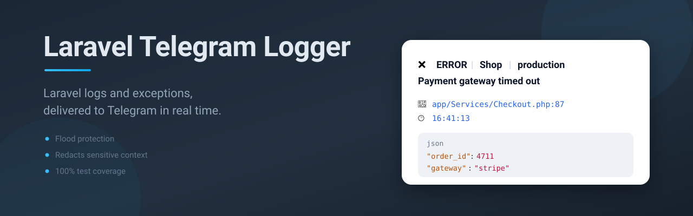

# 📢 Laravel Telegram Logger

🚀 **Laravel Telegram Logger** is a package that sends **Laravel log messages** and **exceptions** to **Telegram** for real-time monitoring.

## 📌 Features

✅ **Real-time logging** to Telegram  
✅ **Supports all log levels** (`debug`, `info`, `warning`, `error`, etc.)  
✅ **Automatic exception handling** (captures error file, line, and message)  
✅ **Configurable log level filtering**  
✅ **Silent notifications support** (to avoid sound/vibration in Telegram)  
✅ **Minimal setup, easy to integrate**  
✅ **Can be enabled/disabled via configuration**

---

## 📋 Requirements

- PHP 8.4+
- Laravel 13.0+
- `allow_url_fopen` enabled in `php.ini` (the default)

## 🛠 Installation

Require the package via Composer:

```bash
composer require marekmiklusek/telegram-logger
```

## 🔧 Configuration

Publish the package configuration:

```bash
php artisan vendor:publish --tag=telegram-logger-config
```

This will create a config file at `config/telegram-logger.php`.

### .env Configuration

Add your Telegram Bot API token and Chat ID to your `.env` file:

```env
TELEGRAM_BOT_TOKEN=your_bot_token
TELEGRAM_CHAT_ID=your_chat_id
```

All other options are configurable via `.env` as well:

```env
TELEGRAM_LOG_LEVEL=error
TELEGRAM_LOG_SILENT=false
TELEGRAM_LOG_ENABLED=true
TELEGRAM_LOG_THROW_ON_FAILURE=false
TELEGRAM_LOG_MAX_PER_MINUTE=20
TELEGRAM_LOG_DEDUPE_SECONDS=60
```

### Config File (`config/telegram-logger.php`)

```php
return [
    'bot_token' => (string) env('TELEGRAM_BOT_TOKEN', ''),
    'chat_id' => (string) env('TELEGRAM_CHAT_ID', ''),
    'level' => (string) env('TELEGRAM_LOG_LEVEL', 'error'),
    'silent_notification' => (bool) env('TELEGRAM_LOG_SILENT', false),
    'is_enabled' => (bool) env('TELEGRAM_LOG_ENABLED', true),
    'throw_on_failure' => (bool) env('TELEGRAM_LOG_THROW_ON_FAILURE', false),
    'api_url' => (string) env('TELEGRAM_LOG_API_URL', 'https://api.telegram.org'),
    'base_path' => base_path(),
    'max_per_minute' => (int) env('TELEGRAM_LOG_MAX_PER_MINUTE', 20),
    'dedupe_seconds' => (int) env('TELEGRAM_LOG_DEDUPE_SECONDS', 60),
    'redact_keys' => ['password', 'secret', 'token', 'authorization', 'api_key', 'apikey', 'credit_card', 'cvv'],
];
```

## 🏗 Usage

### Basic Logging

Use Laravel's `Log` facade as usual, and errors will be sent to Telegram automatically:

```php
use Illuminate\Support\Facades\Log;

Log::debug('Debug message');
Log::info('Info message');
Log::warning('Warning message');
Log::error('Error message');
```

### Logging with Context

You can pass additional context to logs:

```php
Log::error('User not found', ['user_id' => 42, 'action' => 'login']);
```

### Logging Exceptions

Exceptions are automatically detected and logged:

```php
try {
    throw new \Exception('Database connection failed!');
} catch (\Exception $exception) {
    Log::error('Unhandled exception occurred', ['exception' => $exception]);
}
```

## ⚙ How It Works

The package listens to Laravel's logging events and sends structured messages to Telegram.

### Example Telegram Log Output

```
❌ ERROR | MyLaravelApp | production
User not found

📍 app/Http/Controllers/UserController.php:45
🕑 10:15:30

{
    "user_id": 42,
    "action": "login"
}
```

### Example Telegram Log Output (Exception)

```
❌ ERROR | MyLaravelApp | production
Unhandled exception occurred

💥 PDOException
Database connection failed!

📍 app/Services/DatabaseService.php:30
🕑 10:18:45
```

## 🎯 Advanced Configuration

### 1️⃣ Logger Enablement

You can enable or disable the logger in `config/telegram-logger.php`:
```php
return [
    'is_enabled' => false,
];
```

✅ If `true`, logs will be sent to Telegram as configured  
✅ If `false`, the logger will be completely disabled (no logs sent)

### 2️⃣ Log Level Filtering

You can define the minimum log level in `config/telegram-logger.php`:
```php
return [
    'level' => 'warning',
];
```

- `debug`: Logs everything
- `info`: Logs `info`, `notice`, `warning`, `error`, `critical`, `alert`, `emergency`
- `error`: Logs `error`, `critical`, `alert`, `emergency`
- `critical`: Logs only `critical`, `alert`, `emergency`

### 3️⃣ Silent Notifications

Enable silent notifications (no sound/vibration) in `config/telegram-logger.php`
```php
return [
    'silent_notification' => true,
];
```

✅ If `true`, messages will be sent silently.  
✅ If `false`, Telegram will send notifications normally.

### 4️⃣ Failure Reporting

By default a failed delivery is swallowed — a logger must never break the application:
```php
return [
    'throw_on_failure' => false,
];
```

Set `TELEGRAM_LOG_THROW_ON_FAILURE=true` locally to surface the actual Telegram API error
(invalid token, chat not found, rate limit) instead of silence.

If Telegram rejects the message formatting (HTTP 400), the package automatically retries once
as plain text, so the log is delivered even when formatting fails.

## 💡 Troubleshooting

❓ **Logs not appearing in Telegram?**
1. Set `TELEGRAM_LOG_THROW_ON_FAILURE=true` — the real API error will be thrown.
2. Check that your `.env` values are correctly set:
```bash
php artisan config:clear
php artisan config:cache
```
3. Ensure your bot has permission to send messages to your chat.
4. Verify `TELEGRAM_LOG_LEVEL` is not more severe than the level you are logging.
5. Confirm `allow_url_fopen` is enabled — without it the API cannot be reached and
   the package throws `Telegram API is unreachable`.

❓ **Behind a proxy?**

Point `TELEGRAM_LOG_API_URL` at your own Bot API endpoint.

❓ **Getting "Chat not found" error?**
- Make sure you have sent a message to your bot first.
- Use [this tool](https://telegram.me/userinfobot) to get your Chat ID.

### 5️⃣ Flood Protection

An error storm must not turn into hundreds of Telegram requests, so two limits apply:

```php
return [
    'dedupe_seconds' => 60,
    'max_per_minute' => 20,
];
```

- `dedupe_seconds` sends an identical message only once per window
- `max_per_minute` caps how many messages leave the application per minute

Set either to `0` to disable it. Both require a working cache; when no cache is
available they are skipped and logs are delivered as usual.

### 6️⃣ Redacting Sensitive Data

Context is sent to a third party, so known sensitive keys are replaced with `[REDACTED]`:

```php
Log::error('Login failed', ['email' => 'a@b.com', 'password' => 'hunter2']);
```

```
{
    "email": "a@b.com",
    "password": "[REDACTED]"
}
```

Keys are matched case-insensitively as a substring, so `password` also covers
`password_confirmation`. Nested arrays are redacted too. Configure the list via
`redact_keys`, or set it to `[]` to disable redaction.

## 🧪 Testing

```bash
composer test
```

This runs the full quality chain: Pint, Rector, PHPStan (level max),
100% type coverage and the test suite with 100% code coverage.

Individual steps:

```bash
composer test:lint           # Pint code style check
composer test:refactor       # Rector dry run
composer test:types          # PHPStan level max
composer test:type-coverage  # 100% type coverage
composer test:unit           # Pest with 100% code coverage
```

To apply automatic fixes:

```bash
composer lint       # Pint
composer refactor   # Rector
```

## 📝 Changelog

See [CHANGELOG.md](CHANGELOG.md) for release notes and upgrade instructions.

## 📜 License

This package is open-source and licensed under the [MIT License](LICENSE).
